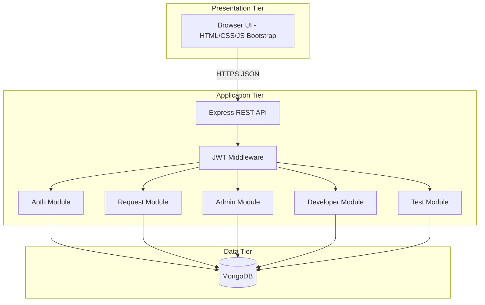

# System Architecture (HLD + LLD)

## 1. High-Level Design (HLD)

### 1.1 Architectural style

**Three-tier, monolithic API** with clear service boundaries by route namespace (logical services):



### 1.2 Logical components

| Component | Responsibility |
|-----------|----------------|
| **Auth service** (`/api/auth`) | Register, login, JWT issuance |
| **Client request service** (`/api/client`) | Create/list requests, feedback |
| **Admin service** (`/api/admin`) | All requests, assignments, staff listing |
| **Developer service** (`/api/developer`) | Assigned tasks, dev status |
| **Tester service** (`/api/tester`) | Assigned QA tasks, verify/bug |
| **Notification service** (planned) | Email/SMS, retries, delivery logs |
| **Reporting service** (planned) | Aggregations, exports, dashboard data |

### 1.3 Cross-cutting concerns

- **Authentication:** JWT in `Authorization` header.  
- **Authorization:** Role arrays on `protect` middleware.  
- **Validation:** To be centralized (e.g. express-validator) as the project matures.  
- **Configuration:** `dotenv` for secrets and connection strings.

---

## 2. Low-Level Design (LLD)

### 2.1 Module layout (repository)

```
config/       db.js — Mongo connection
controllers/  auth, request, admin, dev, tester
middleware/   authMiddleware.js — JWT verify + role check
models/       User, ServiceRequest, Feedback
routes/       authRoutes, requestRoutes, adminRoutes, devRoutes, testerRoutes
public/       static UI and role-specific JS
server.js     app bootstrap, static mount, route registration
```

### 2.2 Request processing (typical authenticated call)

1. Express parses JSON body.  
2. `protect(['role'])` extracts Bearer token, verifies with `JWT_SECRET`, attaches `req.user`.  
3. Controller loads/updates Mongoose models, returns JSON.  
4. Client stores token in `localStorage` (current UI); production may add httpOnly cookies for XSS hardening.

### 2.3 Class / responsibility mapping (conceptual)

| Concept | Implementation |
|---------|----------------|
| User entity | `models/User.js` |
| ServiceRequest aggregate | `models/ServiceRequest.js` |
| Feedback | `models/Feedback.js` |
| Auth use cases | `authController` |
| Request use cases | `requestController`, `adminController`, `devController`, `testerController` |

### 2.4 Planned LLD extensions

- **NotificationWorker:** queue or cron to process `Notification` documents.  
- **ReportService:** read-only queries + CSV/PDF generation.  
- **RateLimiter / LockoutStore:** Redis or in-memory for failed login counts.

### 2.5 Deployment view (summary)

Single Node process behind HTTPS reverse proxy; MongoDB as managed cluster or VM. Details in **DEPLOYMENT_PLAN.md**.
