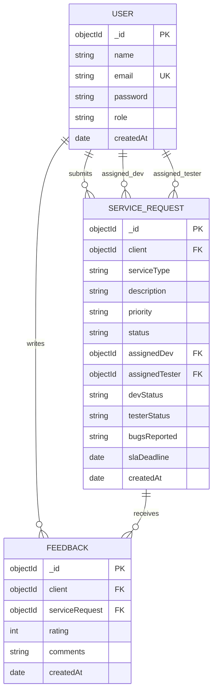

# Database Design

**Store:** MongoDB (document database). **ODM:** Mongoose.  
Relational concepts below are expressed as **collections**, **fields**, and **references** (analogous to tables and foreign keys).

---

## 1. Entity-Relationship (conceptual)

---

## 2. Collection: `users`

| Attribute | Type | Constraints | Notes |
|-----------|------|-------------|--------|
| `_id` | ObjectId | PK | Auto |
| `name` | String | required | |
| `email` | String | required, unique | Indexed by unique constraint |
| `password` | String | required | bcrypt hash |
| `role` | String | enum | `client`, `admin`, `developer`, `tester` |
| `createdAt` | Date | default now | |

**Planned fields (PDF / security):** `failedLoginCount`, `lockedUntil`, `twoFactorSecret`, `twoFactorEnabled`, `passwordResetToken`, `passwordResetExpires`.

---

## 3. Collection: `servicerequests`

| Attribute | Type | Constraints | Notes |
|-----------|------|-------------|--------|
| `_id` | ObjectId | PK | Auto |
| `client` | ObjectId | ref User, required | Submitter |
| `serviceType` | String | required | |
| `description` | String | required | |
| `priority` | String | enum | `Low`, `Medium`, `High` |
| `status` | String | enum | Lifecycle states |
| `assignedDev` | ObjectId | ref User, nullable | |
| `assignedTester` | ObjectId | ref User, nullable | |
| `devStatus` | String | enum | `Not Started`, `In Progress`, `Completed` |
| `testerStatus` | String | enum | `Pending`, `Bugs Found`, `Verified` |
| `bugsReported` | String | nullable | |
| `slaDeadline` | Date | nullable | |
| `createdAt` | Date | default now | |

**Recommended indexes (performance):**

- `{ client: 1, createdAt: -1 }` — client dashboard  
- `{ assignedDev: 1, createdAt: -1 }` — developer tasks  
- `{ assignedTester: 1, devStatus: 1 }` — tester queue  
- `{ status: 1, createdAt: -1 }` — admin filtering (when added)

---

## 4. Collection: `feedbacks`

| Attribute | Type | Constraints | Notes |
|-----------|------|-------------|--------|
| `_id` | ObjectId | PK | |
| `client` | ObjectId | ref User, required | |
| `serviceRequest` | ObjectId | ref ServiceRequest, required | |
| `rating` | Number | 1–5, required | |
| `comments` | String | optional | |
| `createdAt` | Date | default now | |

---

## 5. Planned collections (notifications & reports)

### 5.1 `notifications` (proposed)

| Attribute | Type | Purpose |
|-----------|------|---------|
| `_id` | ObjectId | PK |
| `userId` | ObjectId | Recipient |
| `channel` | String | `email`, `sms` |
| `templateKey` | String | e.g. `REQUEST_ASSIGNED` |
| `payload` | Object | Template data |
| `status` | String | `pending`, `sent`, `failed` |
| `attempts` | Number | Retry count |
| `lastError` | String | Diagnostics |
| `createdAt` / `sentAt` | Date | Auditing |

### 5.2 `reports` or object storage (proposed)

- Option A: Store **metadata** in Mongo (`reportId`, `generatedBy`, `filters`, `fileUrl`, `createdAt`).  
- Option B: Files in blob storage (S3/Azure Blob) with URL in Mongo.

---

## 6. Relationships summary

| From | To | Cardinality | Implementation |
|------|-----|-------------|----------------|
| User | ServiceRequest (as client) | 1:N | `ServiceRequest.client` |
| User | ServiceRequest (as dev) | 1:N | `ServiceRequest.assignedDev` |
| User | ServiceRequest (as tester) | 1:N | `ServiceRequest.assignedTester` |
| User | Feedback | 1:N | `Feedback.client` |
| ServiceRequest | Feedback | 1:N | `Feedback.serviceRequest` |

---

## 7. State lifecycle (service request)

`Pending Approval` → `Assigned` → `In Development` ↔ `In Testing` → `Ready for Delivery` → `Completed` (or `Rejected` from early states).  
Exact transitions are enforced in application logic (`adminController`, `devController`, `testerController`).
