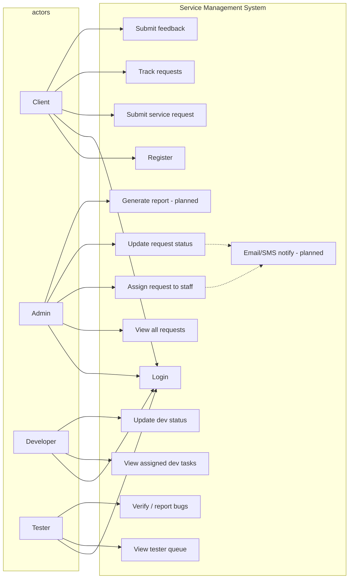
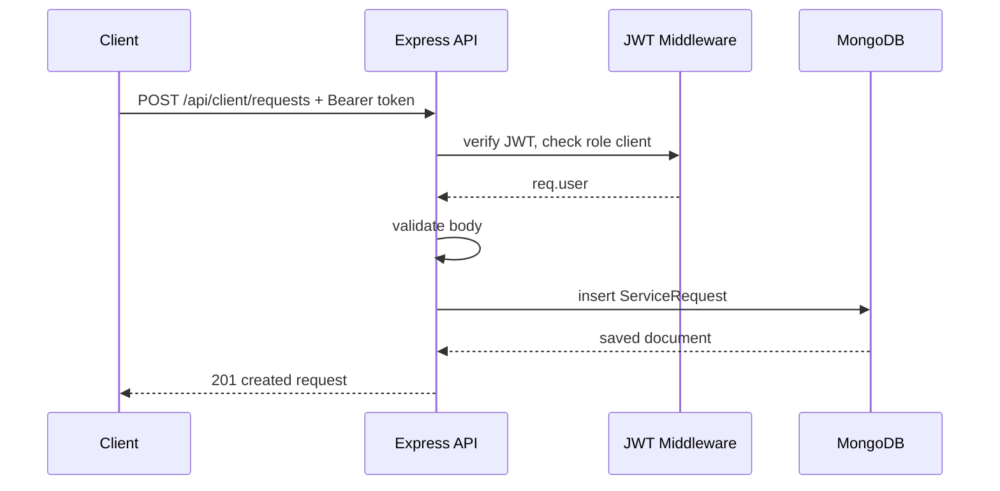
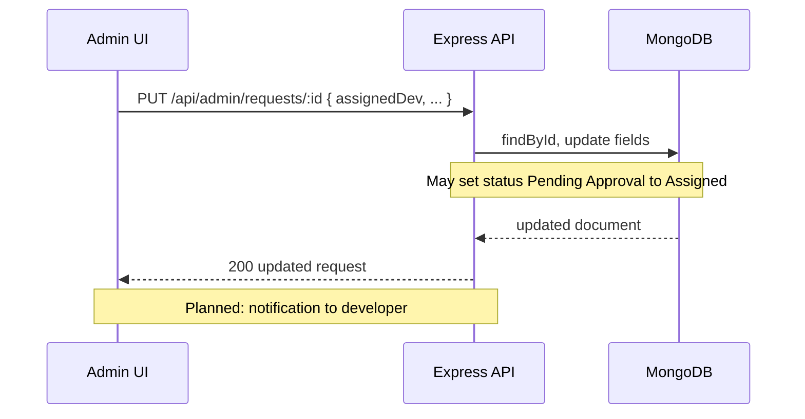
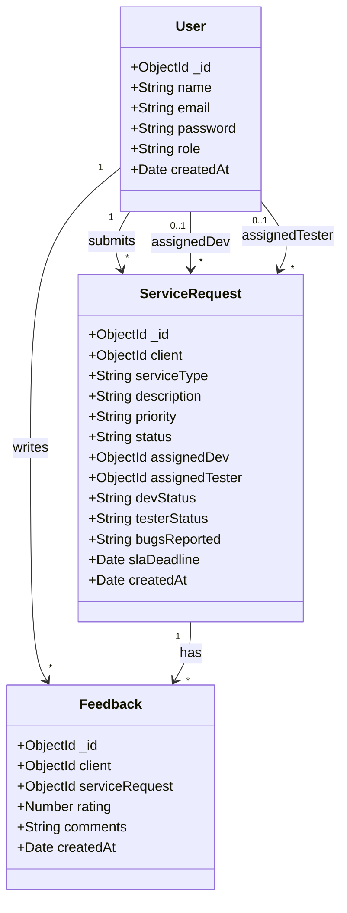
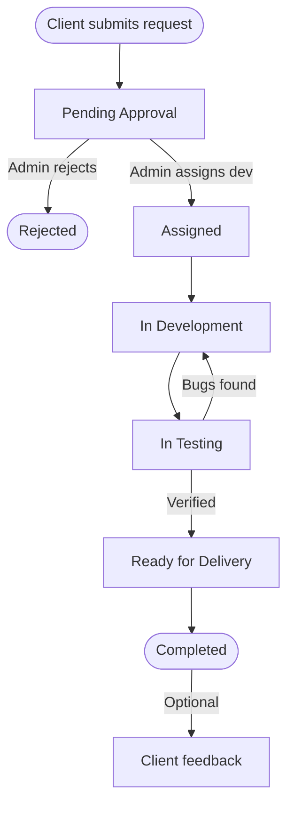

# Use Cases and UML Diagrams

Diagrams use [Mermaid](https://mermaid.js.org/) (render in GitHub, VS Code, or export to images for reports).

---

## 1. Actors

| Actor | Description |
|-------|-------------|
| **Client** | End customer submitting and tracking service requests |
| **Admin** | Operates backlog: assign, reprioritize, change status |
| **Developer** | Executes assigned development work |
| **Tester** | Verifies or returns work with bugs |

---

## 2. Use case diagram



---

## 3. Sequence diagram — Login

```mermaid
sequenceDiagram
  participant U as User Browser
  participant API as Express API
  participant DB as MongoDB

  U->>API: POST /api/auth/login { email, password }
  API->>DB: find user by email
  DB-->>API: user document (hash)
  API->>API: bcrypt.compare(password, hash)
  alt valid
    API->>API: sign JWT(id, role, name)
    API-->>U: 200 { user fields, token }
    U->>U: store token; redirect to dashboard
  else invalid
    API-->>U: 401 { message }
  end
```

---

## 4. Sequence diagram — Submit service request



---

## 5. Sequence diagram — Admin assigns developer (simplified)



---

## 6. Class diagram (domain model)



---

## 7. Activity diagram — Request lifecycle (high level)



---

## 8. Table — Use case to API mapping

| Use case | Primary API |
|----------|-------------|
| Register | `POST /api/auth/register` |
| Login | `POST /api/auth/login` |
| Submit request | `POST /api/client/requests` |
| Track requests | `GET /api/client/requests` |
| Feedback | `POST /api/client/feedback` |
| Admin view all | `GET /api/admin/requests` |
| Assign / update | `PUT /api/admin/requests/:id` |
| Dev tasks | `GET /api/developer/tasks` |
| Dev status | `PUT /api/developer/tasks/:id/status` |
| Tester queue | `GET /api/tester/tasks` |
| Verify | `PUT /api/tester/tasks/:id/verify` |
| Report bug | `PUT /api/tester/tasks/:id/bug` |
